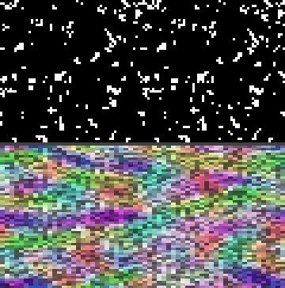
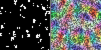
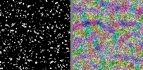

# LifeFlux - Advanced Cellular Automaton with Flow Dynamics

**LifeFlux** is a sophisticated implementation of Conway's Game of Life extended with continuous potential fields and fluid-like dye advection, creating a "LifeFlux" experience with stunning visualizations of emergent flow patterns, vortices, and attractors.

[](https://www.python.org/downloads/)
[](https://developer.nvidia.com/cuda-downloads)
[](https://opensource.org/licenses/MIT)

## 🌟 Key Features

- **🧬 Enhanced Conway's Life**: Traditional Game of Life + optional potential field dynamics
- **🌊 Flow Visualization**: Colored dye field reveals hidden flow patterns and attractors  
- **⚡ CUDA Acceleration**: GPU-optimized for massive grids (500x500+ cells)
- **🎨 Rich Visualizations**: HSV color mapping shows flow direction and intensity
- **🎮 Interactive Controls**: Real-time parameter adjustment and recording
- **🔬 3D Extension**: Full 3D cellular automaton with volumetric rendering
- **📊 Convergence Analysis**: Automatic detection of pattern stability
- **🎛️ Tunable Chaos**: Adjustable field influence from pure Conway to full chaos

## 🎬 Live Demo

### LifeFlux in Action: Cellular Life + Flow Dynamics
Experience the mesmerizing interplay between cellular automaton evolution and flow field dynamics:

<div align="center">


*Left: Cellular Life Evolution | Right: Flow Field Visualization*

</div>

### Conway's Life vs. Life 2.0 Comparison
See how traditional Conway's Game of Life compares to our enhanced Life 2.0 with potential fields:

<div align="center">



*Top Row: Conway's Life (left) vs Life 2.0 (right) | Bottom: Flow Field Dynamics*

</div>

### Parameter Exploration
Watch how different `phi_influence` values affect system behavior (φ = 0.0, 0.2, 0.5, 0.8):

<div align="center">



*Each section shows 40 steps with different field influence values*

</div>

## 🚀 Quick Start

### Installation

```bash
# Clone the repository
git clone https://github.com/yourusername/lifeflow.git
cd lifeflow

# Install with pip
pip install -e .

# Or install dependencies manually
pip install -r requirements.txt

# Optional: For CUDA acceleration
pip install cupy-cuda12x  # For CUDA 12.x

# Optional: For 3D visualization  
pip install open3d
```

### Basic Usage

```bash
# Interactive 2D Life 2.0 with colored flow visualization
python src/lifeflux2d.py --realtime --matrix 100x100

# Pure Conway's Life 
python src/lifeflux2d.py --realtime --phi-influence 0.0 --matrix 80x80

# CUDA-accelerated large simulation
python src/lifeflux2d.py --realtime --cuda --matrix 300x300

# 3D Life with volumetric visualization
python src/lifeflux3d.py --size 32 --life-mode life3d

# Generate GIF animations
python src/lifeflux2d.py --matrix 120x120 --steps 200 --out-dir results

# Create side-by-side demo (Life + Flow) - optimized for showcase
python src/lifeflux2d.py --matrix 100x100 --steps 100 --life-mode life2 --demo --out-dir demo
```

## 🎨 Visual Gallery

### 2D Flow Patterns

<div align="center">

**Pure Conway's Game of Life**


**Vortex Formation in Life 2.0**


</div>

- **Colored Dye Field**: Flow direction mapped to hue, intensity to saturation
- **Vortex Formation**: Self-organizing spiral patterns and attractors
- **Probability Collapse**: Watch chaos emerge from simple rules
- **High-Resolution Demos**: Available in multiple sizes for different viewing needs

### 3D Volumetric Rendering  
- **26-Neighbor Rules**: True 3D cellular automaton
- **Volumetric Flow**: 3D potential fields and dye advection
- **Interactive 3D View**: Real-time OpenGL rendering

## 🔧 Core Components

### Life2D Simulator (`src/lifeflux2d.py`)
- **Dual-mode operation**: Standard Conway + Life 2.0 with fields
- **Optimized algorithms**: FFT blur (CPU), cuSphinx filters (GPU) 
- **Real-time visualization**: Interactive matplotlib interface
- **Export capabilities**: High-quality GIF generation

### Life3D Simulator (`src/lifeflux3d.py`)
- **3D Conway rules**: 26-connectivity neighbor counting
- **Volumetric potential field**: 3D Gaussian blur and advection
- **Open3D visualization**: Interactive 3D point clouds
- **PLY export**: 3D data export for external analysis

### Advanced Features
- **Convergence Detection**: Sliding window stability analysis
- **CUDA Acceleration**: CuPy-based GPU computing
- **Flow Dynamics**: Semi-Lagrangian advection scheme
- **Color Science**: Vectorized HSV→RGB conversion

### 🎬 GIF Recording & Export
- **Multi-format Output**: Separate GIFs for cells, dye field, and combined view
- **Side-by-side Visualization**: Automatic generation of split-screen demos
- **Demo Mode**: Optimized settings for showcase-quality recordings
- **Scalable Resolution**: Display scaling from 1x to 4x for different needs
- **Professional Quality**: High-resolution exports suitable for presentations

**Generated Files:**
- `lifeflux2d_cells.gif` - Pure cellular evolution
- `lifeflux2d_dye.gif` - Flow field visualization  
- `lifeflux2d_combo.gif` - Overlay visualization
- `lifeflux2d_side_by_side.gif` - Split-screen demo
- `lifeflux2d_demo.gif` - Enhanced demo with titles

## 📋 System Requirements

### Minimum Requirements
- **Python**: 3.9+
- **RAM**: 4GB for moderate simulations
- **CPU**: Multi-core recommended for large grids

### Optimal Performance  
- **GPU**: CUDA-compatible (GTX 1060+ / RTX series)
- **RAM**: 16GB+ for massive simulations
- **VRAM**: 4GB+ for large CUDA grids
- **Display**: Hardware-accelerated OpenGL for 3D

### Dependencies
- **Core**: numpy, matplotlib, scipy, imageio
- **GPU**: cupy-cuda12x (CUDA 12.x) or cupy-cuda11x (CUDA 11.x)
- **3D**: open3d (for 3D visualization)
- **Development**: pytest, black, mypy

## 🧪 Testing & Development

```bash
# Run test suite
pytest tests/

# Run benchmarks
python tests/benchmark.py

# Integration tests
python tests/test_integration.py

# Code formatting
black src/ tests/

# Type checking
mypy src/
```

## 📚 Documentation

- **[Getting Started Guide](docs/README.md)**: Comprehensive usage examples
- **[3D Implementation](docs/README_3D.md)**: 3D cellular automaton details  
- **[API Reference](docs/api.md)**: Complete function documentation
- **[Performance Guide](docs/performance.md)**: Optimization tips and benchmarks

## 🎛️ Configuration Reference

### Life Rules & Dynamics
- `--life-mode {standard,life2}`: Conway vs Life 2.0 mode
- `--phi-influence FLOAT`: Field influence (0.0=pure Conway, 1.0=full chaos)
- `--flow-gain FLOAT`: Flow field strength for vortex intensity
- `--kernel-sigma FLOAT`: Potential field smoothing

### Performance & Scale
- `--cuda`: Enable GPU acceleration
- `--matrix WxH`: Grid dimensions (e.g., `400x300`)  
- `--display-scale N`: Resolution multiplier for visualization

### Visualization
- `--colored-dye` / `--grayscale-dye`: Dye field color mode
- `--realtime`: Interactive mode with controls
- `--out-dir PATH`: Output directory for GIFs

## 🤝 Contributing

Contributions welcome! Please see [CONTRIBUTING.md](CONTRIBUTING.md) for:
- Code style guidelines
- Development setup
- Testing procedures
- Pull request process

## 📄 License

This project is licensed under the MIT License - see the [LICENSE](LICENSE) file for details.

## 🔬 Scientific Applications

LifeFlux serves as a platform for:
- **Complex Systems Research**: Emergent behavior analysis
- **Pattern Formation Studies**: Attractor and vortex dynamics
- **Computational Biology**: Cellular interaction modeling  
- **Fluid Dynamics Education**: Visualization of flow concepts
- **Art & Creative Coding**: Generative pattern creation

## 🙏 Acknowledgments

- **John Conway**: For the original Game of Life
- **CuPy Team**: For exceptional GPU computing tools
- **Open3D**: For 3D visualization framework
- **Scientific Python Community**: For the foundational libraries

---

**Explore the probability collapse spectacle!** 🌊✨🎨

*Try different seeds and watch how identical rules create completely different emergent landscapes...*
